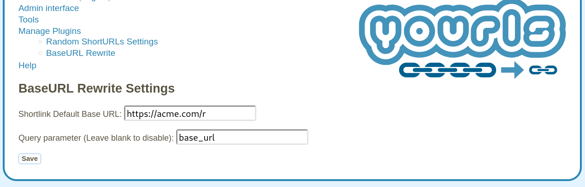

# BaseURL Rewrite 

<!-- Once you have committed code, get your plugin listed in Awesome YOURLS ! See https://github.com/YOURLS/awesome-yourls -->

Tested with [YOURLS](https://yourls.org), version `1.9.2`.

## Usage

The only configuration option for the "BaseURL Rewrite" plugin is a text string
that specifies the base URL of generated shortlinks.

This base URL can be different from the domain from which YOURLS is served.
Rewrite short links such that they point to another (base) domain (e.g.,
``https://acme.com/r``), which can be helpful if you want to serve YOURLS from a
sub-domain (e.g., ``https://link.acme.com``), but generate short links for a
sub-directory of the domain for your main web presence (e.g.,
``https://acme.com/r``).

If the shortlink base URL is not defined, the short link base URL is the same as
``YOURLS_SITE`` (as defined in `config.php`).

:bulb: NOTE: You must take care that the other end (e.g., ``https://acme.com/r``)
performs redirects to the site where YOURLS is served from (e.g.
``https://link.acme.com``).

## Installation

### The easy way: git

Change directory to `user/plugins` and clone the `git` repository of this plugin:

    cd user/plugins
    git clone https://github.com/christian-krieg/yourls-plugin-baseurl-rewrite

### The hard way: manual copy

1. In `user/plugins`, create a new folder named `yourls-plugin-baseurl_rewrite`.
2. Drop these files in that directory.
3. Go to the Plugins administration page (e.g. `http://sho.rt/admin/plugins.php`) and activate the plugin.
4. Have fun!

## License

This package is licensed under the [MIT License](LICENSE).
